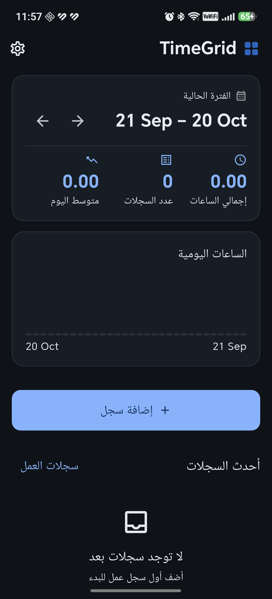

# TimeGrid

**Track billable work by day, and hand each consulting office a timesheet they already recognise.**

A small, offline-first Android app for engineers who log hours against client
projects and have to submit them in a company-specific Excel sheet every month.
No accounts, no backend, no network permission — the whole database lives on
the phone.

> تطبيق أندرويد لتسجيل ساعات العمل اليومية وإصدار الجداول الزمنية للمكاتب الاستشارية.
> يعمل بدون إنترنت وبدون حسابات، والبيانات كلها على الجهاز.

---

## Why this exists

Consulting engineers usually track hours twice: once for themselves and once
again in the client's own timesheet format at the end of the month. TimeGrid
removes the second pass. It keeps the log on the phone, then fills **the
office's existing spreadsheet** — preserving its layout, styles and formulas —
and hands it back as a file that goes straight to the client.

---

## Screenshots

| Dashboard | Current period |
| --- | --- |
|  | The home screen scopes every number to one consulting office, so the totals always match the report you are about to send. |

---

## Features

**Logging**
- One entry per project / task / day, with hours and an optional note.
- Pick the consulting office first; the project list then narrows to that
  office's projects.
- Create a project, task or office **from inside the entry form** — no
  detour to a separate screen.
- Warns before saving a duplicate entry, and before saving into a period that
  has already ended.
- Zero-hour entries are refused in the UI and by a `CHECK (hours > 0)` in the
  database.
- Deleting offers **Undo**, which restores the same row with the same id.

**Reporting**
- Totals per period, per project, per task, per day.
- Reports are scoped to a chosen office — a timesheet always belongs to one.
- Export to the office's **Excel template** (`.xlsx` or legacy SpreadsheetML
  `.xls`), filled in place.
- Export a print-ready **A4 landscape PDF** in Arabic.
- **Export history**: what was produced, for which office and period.
- **Period locking**: after a timesheet goes out, the app offers to lock that
  period, and a locked period refuses edits — the numbers the client received
  cannot drift.

**Data**
- **Backup / restore** as one JSON file, and **share** it straight off the
  device.
- Additive-only schema migrations, a byte-copy of the database taken before
  any upgrade, and downgrades refused rather than allowed to wipe data.
- Optional **app lock** using the device's fingerprint or screen lock, which
  re-engages when the app goes to the background.

**Design**
- Arabic-first, full RTL, with an English translation; light and dark themes
  following the system.

---

## How it works

```
lib/
  app/            MaterialApp, GoRouter, themes, generated localizations
  core/
    models/       plain data classes
    database/     AppDatabase: schema, migrations, safety copies
    repositories/ SQL only — no UI, no Flutter widgets
    providers/    Riverpod wiring
    security/     the app lock
    services/     sharing
    utils/        period arithmetic, bidi helpers
    widgets/      pickers shared across features
  features/       one folder per screen, layered presentation / domain / data
```

- **State**: Riverpod, with providers deriving from a single scoped source so
  the dashboard's totals and the exported report can never disagree.
- **Persistence**: `sqflite`, one database, no ORM.
- **Testing**: everything that can run without a device does; the rest is
  covered by `integration_test/` on a real phone.

### The bits worth reading

| Topic | Where |
| --- | --- |
| The data-safety contract (additive migrations, pre-upgrade copies, refused downgrades) | `lib/core/database/app_database.dart` |
| Period arithmetic, including custom cycle start days and short months | `lib/core/utils/period_calculator.dart` |
| Filling the SpreadsheetML template in place | `lib/features/reports/data/spreadsheetml_exporter.dart` |
| Why the PDF is painted by Flutter instead of a PDF library | `lib/features/reports/data/pdf_timesheet_exporter.dart` |
| Bidi isolation for dates inside Arabic text | `lib/core/utils/bidi.dart` |

Longer notes — how the earlier Android build was migrated, the real structure
of the company template, a measured PDF dead end, and the bidi fix — are in
**[docs/NOTES.md](docs/NOTES.md)**.

---

## Getting started

Requires **Flutter 3.47+** (Dart 3.13+).

```bash
flutter pub get   # also generates the localizations from lib/l10n/*.arb
flutter analyze
flutter test
flutter run
```

Building an APK:

```bash
# one APK for every ABI (~59 MB)
flutter build apk --release

# one per ABI (~20 MB each)
flutter build apk --release --split-per-abi \
  -P force-version-code-ignoring-abi=true
```

`-P force-version-code-ignoring-abi=true` matters: without it Flutter offsets
`versionCode` per ABI, and switching between a split and a universal APK later
would be refused as a downgrade.

### The Excel template

The app fills **your** template; it never rebuilds a report from scratch. Two
formats are understood, detected from the file's own bytes:

| Template | How it is filled |
| --- | --- |
| OOXML `.xlsx` | `package:excel`, using coordinates you calibrate |
| SpreadsheetML 2003 XML (usually `.xls`) | parsed and edited in place, so every style and merge survives |

Any other format fails with a clear message instead of an opaque error.

The company template used during development is **not** part of this
repository — it belongs to the client. The tests that exercise it skip
themselves when the file is absent, so the suite runs anywhere.

---

## Testing

`flutter test` runs the whole suite on the host:

| Area | Files |
| --- | --- |
| Period arithmetic | `test/period_calculator_test.dart` |
| Report aggregation | `test/report_calculator_test.dart` |
| Excel / SpreadsheetML export | `test/spreadsheetml_exporter_test.dart` |
| Printable PDF document | `test/pdf_timesheet_test.dart` |
| Database, migrations, safety copies | `test/app_database_safety_test.dart`, `test/migration_v1_to_v2_test.dart`, `test/period_lock_test.dart`, `test/export_history_test.dart` |
| Repositories | `test/repository_crud_test.dart`, `test/office_repository_test.dart` |
| Backup and restore | `test/backup_repository_test.dart` |
| Screens (widget tests) | `test/app_smoke_test.dart`, `test/app_lock_gate_test.dart` |

Every schema version has a test that builds a database exactly as the previous
release left it, opens it with the current code, and asserts that every stored
row survived.

`integration_test/` runs **on a connected device** and covers what fakes
cannot — the platform PDF renderer, biometric availability, a backup written
to real storage, and the whole stack from repository to dashboard:

```bash
flutter test integration_test/app_flows_test.dart -d <device-serial>
```

> The integration-test runner uninstalls the app when it finishes, taking the
> app's storage with it. Expect a fresh, empty database afterwards.

---

## Database versions

| Version | Added |
| --- | --- |
| 1 | projects, tasks, work_logs, settings |
| 2 | offices, and `projects.office_id` |
| 3 | locked_periods |
| 4 | exports (the export log) |

Migrations are **additive only**. Before a database file is upgraded, a byte
copy is written beside it as `timegrid.db.pre-v<old>.bak`, and a downgrade is
refused rather than allowed to destroy data.

---

## Limitations

- **One device per install.** There is no sync; move data with the JSON backup.
- The printable PDF embeds the page as an image, so its text is not
  selectable. That is the price of correct Arabic shaping without a shaping
  engine — see the note in `pdf_timesheet_exporter.dart`.
- The `.xlsx` template path still ships placeholder coordinates and needs
  calibrating against a real workbook; the SpreadsheetML path is the one in
  production use.
- No CI yet.

---

## Roadmap

- A timer that turns a running session into an entry.
- "Copy yesterday's work" for repetitive days.
- CSV fallback export, as an escape hatch independent of any template.
- A report preview that mirrors the template before exporting.
- Icon and store listing finalisation for distribution.

---

## License

Released under the MIT License — see [LICENSE](LICENSE).

The app name, icon and the consulting-office workflow were built for private
use; the code is shared as a working example of
[Flutter](https://flutter.dev) + SQLite offline tooling.
